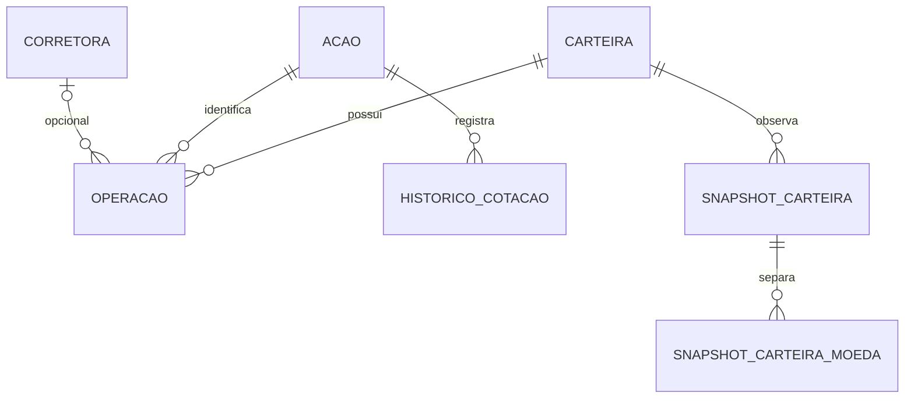

# Gestão de Ações

Aplicação web para centralizar o registro e acompanhamento de carteiras de ações brasileiras e americanas, reduzindo a necessidade de planilhas para consultar posições e resultados.

O MVP permite cadastrar corretoras e ações, criar/renomear carteiras, registrar compras e vendas com corretora opcional e consultar posições, preço médio, resultados realizados/não realizados, rentabilidade e patrimônio por moeda. O dashboard apresenta gráficos e histórico patrimonial por snapshots manuais. Consulte o [PRD](docs/PRD.md) e as [specs OpenSpec](openspec/specs).

## Stack e arquitetura

- Java 17, Spring Boot 4.1.0, Spring MVC, Bean Validation, Spring Data JPA, RestClient, Liquibase e springdoc/OpenAPI.
- PostgreSQL como banco principal; H2 disponível exclusivamente nos testes.
- Angular 22.1.4, TypeScript, Angular Material/CDK, RxJS, componentes standalone e SCSS; testes frontend com Vitest/jsdom.
- Maven Wrapper na raiz e workspace npm independente em `frontend/`.

```text
Angular → Resources REST → Services / regras financeiras → Repositories → PostgreSQL
                                  ↓
                          Providers / adapters → APIs externas
```

Os cálculos financeiros usam BigDecimal no backend. Compras recalculam o preço médio ponderado; vendas parciais preservam o preço médio e apuram resultado realizado separadamente. Atualizar a cotação não modifica operações históricas. BRL e USD permanecem separados, sem conversão cambial.



## Pré-requisitos

- JDK 17 compatível com o projeto e `JAVA_HOME` configurado.
- PostgreSQL acessível, banco previamente criado e usuário com permissões para migrations e acesso às tabelas.
- Node `^22.22.3 || ^24.15.0 || ^26.0.0` e npm 11.17.0, conforme `frontend/package.json`. Não é necessária Angular CLI global.
- Acesso aos repositórios Maven/npm na primeira instalação e aos providers nas consultas externas.
- Chaves BRAPI e Alpha Vantage para funcionalidades de mercado.

## Configuração do backend

Use variáveis no ambiente do processo. O projeto não carrega automaticamente `.env`. Não versione senhas ou chaves.

| Variável | Uso / padrão |
| --- | --- |
| `SPRING_PROFILES_ACTIVE` | Use `dev` para desenvolvimento com PostgreSQL |
| `SPRING_DATASOURCE_URL` | Padrão em `dev`: `jdbc:postgresql://localhost:5432/gestaoacoesdb` |
| `SPRING_DATASOURCE_USERNAME` | Usuário do banco; padrão em `dev`: `postgres` |
| `SPRING_DATASOURCE_PASSWORD` | Senha do banco, sem padrão |
| `BRAPI_API_KEY` | Chave das consultas brasileiras |
| `ALPHA_VANTAGE_API_KEY` | Chave das consultas americanas |
| `BRASIL_API_BASE_URL` | `https://brasilapi.com.br` |
| `VIA_CEP_BASE_URL` | `https://viacep.com.br` |
| `BRAPI_BASE_URL` | `https://brapi.dev` |
| `ALPHA_VANTAGE_BASE_URL` | `https://www.alphavantage.co` |
| `BRASIL_API_CONNECT_TIMEOUT`, `VIA_CEP_CONNECT_TIMEOUT`, `BRAPI_CONNECT_TIMEOUT`, `ALPHA_VANTAGE_CONNECT_TIMEOUT` | `2s` cada |
| `BRASIL_API_READ_TIMEOUT`, `VIA_CEP_READ_TIMEOUT`, `BRAPI_READ_TIMEOUT`, `ALPHA_VANTAGE_READ_TIMEOUT` | `5s` cada |
| `ALPHA_VANTAGE_QUOTE_REUSE_INTERVAL` | `15m`: reutilização temporal de cotação EUA |
| `ALPHA_VANTAGE_REFRESH_COOLDOWN` | `15m`: intervalo mínimo de atualização EUA |

As chaves podem estar ausentes ao iniciar, mas as respectivas consultas falham explicitamente sem configuração. BrasilAPI e ViaCEP não recebem chaves pela configuração atual. Veja [application.properties](src/main/resources/application.properties) e [application-dev.properties](src/main/resources/application-dev.properties).

### Banco e migrations

Crie previamente o banco PostgreSQL indicado na URL. Ao iniciar, o Liquibase executa o [changelog principal](src/main/resources/db/changelog/db.changelog-master.yaml), com seis migrations: corretoras, ações, carteiras, operações, histórico de cotações e snapshots (incluindo valores por moeda).

O Hibernate usa `ddl-auto=validate`: valida o schema resultante; a criação/evolução das tabelas pertence ao Liquibase. Um banco legado com tabelas criadas fora do changelog exige reconciliação antes da execução; não há procedimento automático de baseline documentado. Não desabilite migrations para compensar divergências.

Os testes usam H2 efêmero e as migrations do projeto. A aplicação normal não tem H2 como fallback; sem datasource válido, a inicialização falha.

### Executar

Na raiz, em PowerShell, substitua os marcadores localmente (não são credenciais válidas):

```powershell
$env:SPRING_PROFILES_ACTIVE = "dev"
$env:SPRING_DATASOURCE_URL = "jdbc:postgresql://localhost:5432/gestaoacoesdb"
$env:SPRING_DATASOURCE_USERNAME = "<usuario-local>"
$env:SPRING_DATASOURCE_PASSWORD = "<senha-local>"
$env:BRAPI_API_KEY = "<chave-brapi>"
$env:ALPHA_VANTAGE_API_KEY = "<chave-alpha-vantage>"
.\mvnw.cmd spring-boot:run
```

Backend padrão: `http://localhost:8080`. Em Linux/macOS, use `./mvnw` e a sintaxe de exportação do seu shell. Para empacotar: `.\mvnw.cmd package`. O Maven não compila o frontend.

## Executar o frontend

Em outro terminal:

```powershell
cd frontend
npm ci
npm start
```

Abra `http://localhost:4200`. O token `API_BASE_URL` usa `/api`; o [proxy de desenvolvimento](frontend/proxy.conf.json) encaminha para `http://localhost:8080`, removendo `/api`. Na coleção Postman, use diretamente a URL backend, sem esse prefixo.

`npm run build` gera `frontend/dist/frontend/browser/`. O proxy de desenvolvimento não acompanha o build: ao hospedar, configure encaminhamento `/api` e fallback de rotas Angular, ou adapte o provider central de URL. Não há deploy automatizado nesta entrega. Veja [frontend/README.md](frontend/README.md).

## Fluxo básico de uso

1. Crie uma carteira e selecione-a no contexto da aplicação.
2. Cadastre ações por ticker e mercado (`BRASIL`/`EUA`); essa combinação é única e validada no provider correspondente.
3. Opcionalmente, cadastre corretora por CNPJ real. A BrasilAPI fornece dados e o CEP é validado via ViaCEP. Situação cadastral não ativa exige confirmação explícita. Não existe validação regulatória de atuação no mercado financeiro.
4. Registre COMPRA/VENDA com quantidade, preço efetivo e data; ação e carteira devem existir. A corretora é opcional. Quantidade brasileira deve ser inteira; quantidade/preço devem ser positivos, com precisão máxima 19 e até seis casas decimais. Datas futuras não são aceitas.
5. Consulte posições, resumo, resultados e operações. Venda acima do saldo cronológico é rejeitada, inclusive quando inserção retroativa invalidaria operações posteriores.
6. Atualize cotação manualmente no detalhe da ação. Falhas preservam a última cotação válida e a tela informa esse uso.
7. Gere snapshots manualmente no dashboard. Consultar evolução não cria observações nem reconstrói o passado.

Compra e venda exigem preço manual. A prévia de compra consulta fechamento histórico de forma independente; a sugestão de venda usa a última compra aplicável. Nenhuma é ordem de negociação. `ordemNoDia` e `valorTotal` são gerados pelo backend e não são campos de entrada.

## API e coleção Postman

Com o backend ativo:

- Swagger UI: `http://localhost:8080/swagger-ui.html` (interface efetiva em `/swagger-ui/index.html`).
- OpenAPI JSON: `http://localhost:8080/v3/api-docs`.
- OpenAPI YAML: `http://localhost:8080/v3/api-docs.yaml`.
- [Coleção Postman v2.1](docs/api/gestao-acoes.postman_collection.json): importe pelo comando **Import** do Postman; não exige arquivo de ambiente separado.

São **26 combinações de método/path de negócio**, cobertas por **34 requests** incluindo exemplos alternativos, dois casos negativos e três acessos à documentação técnica:

| Domínio | Contratos de negócio |
| --- | --- |
| Corretoras (4) | `POST/GET /corretoras`, `GET /corretoras/{id}`, `GET /corretoras/por-cnpj?cnpj=...` |
| Ações (5) | `POST/GET /acoes`, `GET /acoes/{id}`, `GET /acoes/por-ticker?ticker=...&mercado=...`, `PATCH /acoes/{id}/cotacao` |
| Carteiras (5) | `POST/GET /carteiras`, `GET/PATCH/DELETE /carteiras/{id}` |
| Operações (6) | `POST/GET /operacoes`, `GET /operacoes/{id}`, `GET /operacoes/previa-compra`, `GET /carteiras/{carteiraId}/operacoes`, `GET /carteiras/{carteiraId}/operacoes/sugestao-preco-venda` |
| Indicadores (6) | `GET /carteiras/{carteiraId}/posicoes`, `/resultados-realizados`, `/patrimonio`, `/resumo`, `/evolucao-patrimonial`; `POST /carteiras/{carteiraId}/snapshots` |

Prévia/sugestão recebem `ticker`, `mercado` e `dataOperacao` na query. Não há GET individual de snapshot, apesar do `Location` retornado na criação; a consulta disponível é a evolução. O OpenAPI servido detalha DTOs e erros atuais.

### Usar os exemplos

- Defina `baseUrl` (padrão `http://localhost:8080`), `cnpj` real e `dataOperacao` adequada. Preços/quantidades são exemplos ilustrativos, não cotações.
- Crie carteira e ação antes das operações. Requests de criação e consulta por ticker capturam IDs após sucesso; ou preencha IDs existentes. Cadastro duplicado retorna conflito, sem recuperar o ID automaticamente.
- O fluxo padrão usa PETR4/BRASIL; há cadastro alternativo AAPL/EUA. Para operar EUA, altere ticker/mercado para uma ação já cadastrada.
- `corretoraOperacaoId` começa em `null`. Para associar corretora, substitua por ID numérico existente (por exemplo, o valor de `corretoraId`).
- Execute COMPRA antes de VENDA. Os exemplos compram 10 e vendem 5 na mesma data; o backend gera a ordem. Repetir requests registra novas operações.
- A exclusão usa `carteiraDescartavelId`, capturado na criação específica de carteira vazia. Não registre operações/snapshots nela; carteiras vinculadas não podem ser excluídas.
- Execute manualmente em banco de desenvolvimento. A coleção cria dados, consome cotas externas e contém exclusão efetiva; não é uma carga idempotente.
- Scripts verificam status e JSON; negativos verificam erro padronizado. Falhas externas não contam como sucesso. A prévia pode falhar por data sem cotação ou fora da cobertura, sem impedir o POST manual.

Erros usam `timeStamp`, `status`, `error`, `message`, `path`, `code` e `details`. Exemplos: 400 para entrada inválida, 404 para ausência, 409 para duplicidade/saldo insuficiente e 429/502/503/504 para limites e falhas externas. Os códigos variam por endpoint; consulte o OpenAPI.

## Testes e validação

```powershell
# Raiz: suíte backend, profile test / H2
.\mvnw.cmd test
# Exemplo de contrato focado
.\mvnw.cmd "-Dtest=OpenApiDocumentationTest" test

# Dentro de frontend/
npm test -- --watch=false
npm test -- --watch=false --include=src/app/features/acoes/pages/acao-detail-page.component.spec.ts
npm run build
```

Testes backend cobrem regras financeiras, REST, persistência e adapters com respostas controladas; não equivalem à homologação de chaves/planos reais. Testes frontend usam Vitest/jsdom; o build valida compilação e templates.

Com OpenSpec instalado: `openspec validate --all --strict`. Graphify apoia consultas de dependências; após alterações de código, use `graphify update .` conforme [AGENTS.md](AGENTS.md).

## Integrações e limitações

| Integração | Responsabilidade implementada |
| --- | --- |
| BRAPI | Validar ação brasileira, obter/atualizar cotação e consultar fechamento histórico da data exata |
| Alpha Vantage | Validar ação americana e obter cotação; histórico diário em modo `compact` |
| BrasilAPI | Consultar dados cadastrais pelo CNPJ |
| ViaCEP | Consultar e validar o CEP obtido no cadastro da corretora |

Esses providers atendem aos mercados/validações do PRD e ficam isolados em adapters. Não há endpoint público separado para consulta livre de CEP ou proxy de candles. BRAPI recebe Bearer token e Alpha Vantage recebe chave no parâmetro da consulta, exclusivamente no backend.

Cotas e cobertura dependem das credenciais/planos externos; o projeto não fixa garantia de requisições diárias. A aplicação trata timeout, limite e resposta inválida, sem polling automático. EUA usa reutilização/cooldown padrão de 15 minutos para reduzir consumo; isso não substitui limites do fornecedor. Histórico `compact` tem alcance limitado; não se inventa preço para datas ausentes. A cotação persistida pode estar defasada, sem garantia de tempo real.

Outras limitações:

- Sem autenticação, usuários, permissões, envio de ordens ou integração automática com corretoras.
- Sem outras classes de investimento, impostos, taxas, dividendos ou eventos corporativos.
- Sem conversão cambial; patrimônio/resultados separados por moeda.
- Sem edição/exclusão de operações ou exclusão de ações/corretoras na API. Carteira só pode ser excluída sem operações e snapshots.
- Listagens/evolução sem paginação; snapshots manuais, sem reconstrução retroativa automática.
- Build frontend com avisos de budget do bundle inicial e CSS de evolução, sem impedir compilação.

### Pendência operacional já registrada

A credencial PostgreSQL anteriormente exposta em arquivo versionado deve ser revogada/rotacionada no ambiente antes de voltar a ser utilizada. Remover valores do repositório não revoga credenciais nem remove ocorrências no histórico Git. Esta entrega não confirma rotação externa nem reescreve o histórico.

## Estrutura

```text
src/main/java/com/projeto/  resources, dto, services, repositories, entities, integrations, config
src/main/resources/        configuração Spring e migrations Liquibase
src/test/                  testes backend e configuração H2
frontend/src/app/          core, layout, shared e features
docs/                      PRD e coleção de API
openspec/                  specs e changes
graphify-out/              grafo de conhecimento local
```
