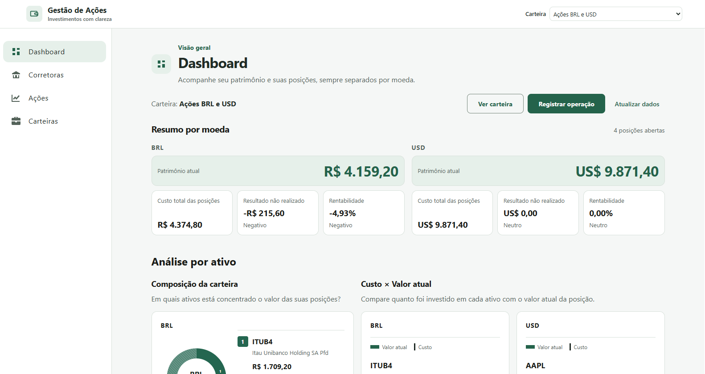
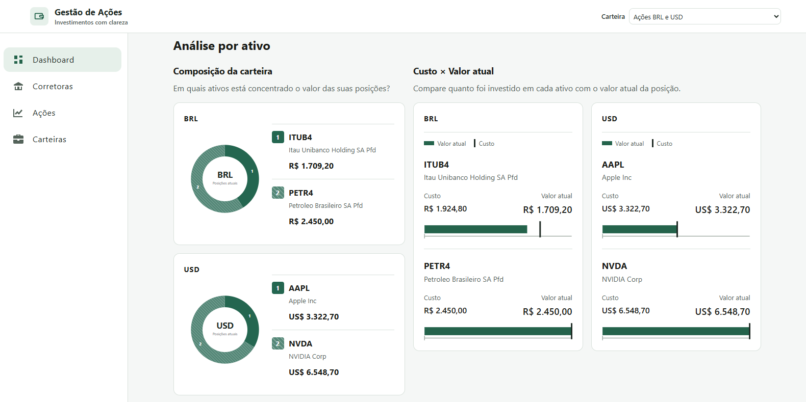
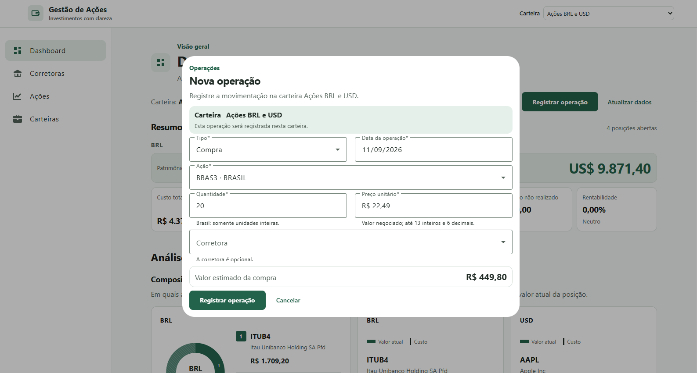
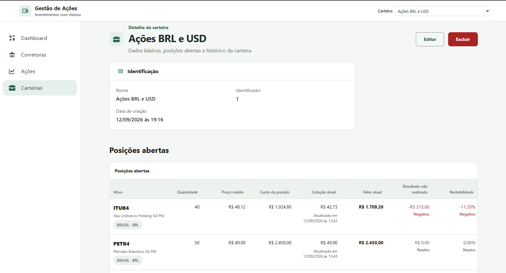
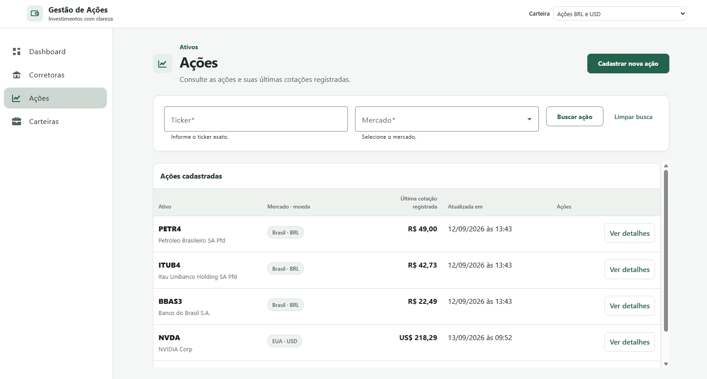
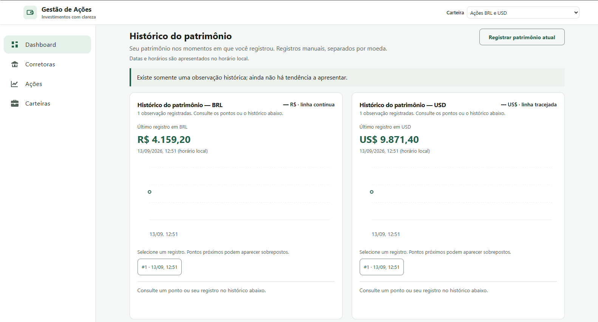
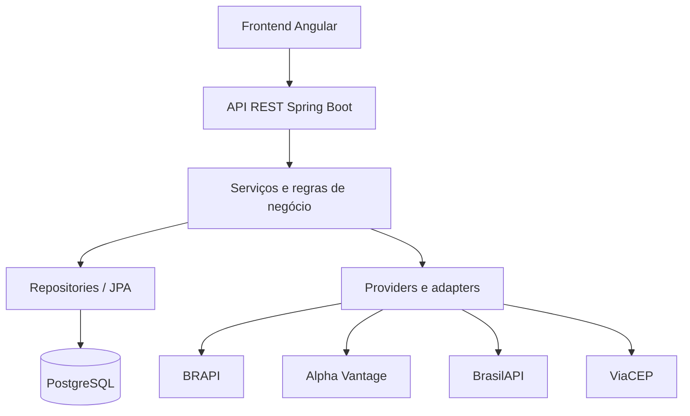

# Gestão de Ações

Aplicação web para gerenciamento e acompanhamento de carteiras de investimentos, com suporte inicial a **ações brasileiras e americanas**. Permite cadastrar ativos e corretoras, registrar compras e vendas e acompanhar posições, patrimônio, rentabilidade e evolução patrimonial.

**BRL e USD são tratados separadamente, sem conversão cambial automática.**

## Sobre o projeto

O Gestão de Ações centraliza informações que normalmente ficam distribuídas entre planilhas e consultas de mercado. O histórico de operações é a base dos cálculos financeiros; os provedores externos complementam o acompanhamento com dados cadastrais e cotações.

O núcleo atual é focado em carteiras de ações, com posição consolidada por ativo e indicadores separados por moeda. As regras gerais estão no [PRD](docs/PRD.md), e as especificações detalhadas estão no [OpenSpec](openspec/specs).

## ✨ Principais funcionalidades

| Área | Recursos disponíveis |
| --- | --- |
| **Ações BRASIL/EUA** | Cadastro validado por ticker e mercado, listagem, consulta e atualização manual de cotação no detalhe da ação. |
| **Corretoras** | Cadastro por CNPJ, consulta cadastral, validação de endereço e consulta por ID ou CNPJ. |
| **Carteiras** | Criação, consulta, renomeação e exclusão de carteiras sem operações ou snapshots vinculados. Seleção de carteira compartilhada entre telas. |
| **Compras e vendas** | Registro e consulta de operações, corretora opcional, prévia histórica de compra e sugestão de preço de venda, ambas editáveis. |
| **Posições e resultados** | Quantidade atual, preço médio, custo, cotação persistida, valor atual, resultados realizados e não realizados e rentabilidade. |
| **Dashboard** | Resumo por moeda, composição por ativo, comparação entre custo e valor atual, resultado e rentabilidade por ativo. Registro de operação em dialog contextual. |
| **Evolução patrimonial** | Criação manual de snapshots e visualização das observações históricas por moeda. |

“Atualizar dados” no dashboard recarrega as informações persistidas. A consulta de uma nova cotação é uma ação separada, disponível no detalhe da ação. Falhas nessa atualização preservam a última cotação válida e são informadas na interface.

## 🖼️ Demonstração da aplicação

### Dashboard

Resumo da carteira em BRL e USD, com patrimônio das posições, custo, resultado não realizado e rentabilidade.



### Análise por ativo

Composição da carteira e comparação entre custo e valor atual, complementadas por visualizações de resultado e rentabilidade por ativo.



### Registro de operações

Compras e vendas recebem ativo, data, quantidade e preço unitário, com corretora opcional. Na compra, a prévia histórica pode preencher uma sugestão de preço que permanece editável.



### Detalhes da carteira

Consulta das posições abertas e do histórico de operações da carteira selecionada.



### Ações

Consulta dos ativos cadastrados, identificados por ticker, mercado e moeda, com suas cotações persistidas.



### Evolução patrimonial

Acompanhamento do patrimônio por moeda a partir de snapshots registrados manualmente. Consultar o gráfico não cria observações nem reconstrói o passado.



## Regras financeiras

Os cálculos oficiais ficam no backend e utilizam `BigDecimal`, com precisão e arredondamento definidos nas regras do projeto.

| Conceito | Comportamento implementado |
| --- | --- |
| **Compra e preço médio** | A compra aumenta quantidade e custo. `Novo preço médio = (custo anterior + quantidade comprada × preço de compra) / nova quantidade`. |
| **Venda parcial** | Reduz quantidade e custo proporcionalmente, preservando o preço médio unitário remanescente. |
| **Venda total** | Zera quantidade, custo e preço médio. Uma nova compra inicia novamente a formação da posição. |
| **Resultado realizado** | `(Preço de venda − preço médio anterior) × quantidade vendida`. Permanece separado do custo das ações restantes. |
| **Valor atual** | `Quantidade aberta × cotação persistida`. |
| **Resultado não realizado** | `Valor atual − custo da posição`. |
| **Rentabilidade** | `Resultado não realizado / custo positivo × 100`. |
| **Patrimônio** | Soma do valor atual das posições abertas, separada por moeda; não representa saldo em dinheiro de uma conta de investimentos. |

- Venda acima da quantidade cronologicamente disponível é rejeitada, inclusive se uma inserção retroativa invalidar operações posteriores.
- O processamento respeita `dataOperacao` e `ordemNoDia`. A ordem no dia e o `valorTotal` são gerados pelo backend.
- Quantidade e preço devem ser positivos e representáveis com até 13 dígitos inteiros e seis casas decimais. Ações brasileiras exigem quantidade inteira; datas futuras não são aceitas.
- BRL e USD não são somados em um total convertido. A cotação mais recente pode estar defasada e não modifica os preços das operações já registradas.

**Preço da operação:** o formulário de COMPRA consulta o fechamento bruto da data exata como sugestão inicial, sem substituir por pregão vizinho ou preço ajustado. A VENDA pode sugerir o preço da última compra aplicável na carteira. O usuário pode editar o valor; `POST /operacoes` exige e utiliza o preço final informado, sem nova consulta histórica. Uma falha na prévia não impede o registro com preço válido preenchido manualmente.

## Integrações externas

### BRAPI

A [BRAPI](https://brapi.dev/) valida e fornece cotações de ações brasileiras por `/api/quote/{ticker}`. A prévia de compra utiliza `/api/v2/stocks/historical`, com intervalo diário e a data solicitada.

### Alpha Vantage

A [Alpha Vantage](https://www.alphavantage.co/) fornece dados de ações americanas. O cadastro bem-sucedido realiza `SYMBOL_SEARCH` e `GLOBAL_QUOTE`, com intervalo configurável de **1100 ms** por padrão entre as duas chamadas, sem retry automático ou terceira consulta.

A atualização de uma ação já cadastrada usa `GLOBAL_QUOTE`, com reutilização de cotação e cooldown de 15 minutos por padrão. Essa política pertence à atualização, não ao cadastro nem à prévia histórica. Durante o cooldown, uma falha anterior também pode ser reapresentada sem nova chamada; a coordenação de tentativas é local à instância.

A prévia de COMPRA EUA utiliza `TIME_SERIES_DAILY` em modo `compact`, com cobertura histórica limitada e fechamento da data exata.

### BrasilAPI

A [BrasilAPI](https://brasilapi.com.br/) fornece dados cadastrais pelo CNPJ no cadastro da corretora, via `/api/cnpj/v1/{cnpj}`. CNPJ duplicado é rejeitado; situação cadastral não ativa exige confirmação explícita. A consulta interna por CNPJ procura uma corretora já cadastrada.

### ViaCEP

O [ViaCEP](https://viacep.com.br/) valida o CEP obtido no cadastro da corretora e fornece os dados de endereço, via `/ws/{cep}/json/`.

As integrações ficam isoladas em adapters no backend. BRAPI usa Bearer token e Alpha Vantage recebe a chave na consulta; nenhuma chave é enviada ao frontend. BrasilAPI e ViaCEP não exigem chave na configuração atual. Timeouts, limites de requisição e respostas inválidas são tratados explicitamente. Cotas e cobertura dependem do provedor; não há garantia de cotação em tempo real ou polling automático.

## 🛠️ Tecnologias e ferramentas

| Camada | Tecnologias utilizadas |
| --- | --- |
| **Backend** | Java 17, Spring Boot 4.1.0, Spring MVC, Bean Validation, Spring Data JPA, RestClient e Maven Wrapper. |
| **Frontend** | Angular 22.1.4, TypeScript, Angular Material/CDK, RxJS, componentes standalone e SCSS. |
| **Banco de dados** | PostgreSQL, Liquibase para migrations e H2 exclusivamente nos testes. |
| **Testes e API** | JUnit, Mockito, testes Spring, Vitest/jsdom, springdoc/OpenAPI, Swagger UI e coleção Postman. |
| **Infraestrutura e desenvolvimento** | Docker, Docker Compose, Nginx, Git, OpenSpec e Graphify. |

## Arquitetura do projeto



O frontend apresenta os valores calculados pelo backend. Campos financeiros usam leitura JSON lossless e formatação decimal para evitar perda de precisão; as aproximações usadas para desenhar gráficos não substituem os valores autoritativos. A interface inclui navegação responsiva, feedback contextual e recursos de teclado e acessibilidade.

```text
src/main/java/com/projeto/  API, serviços, entidades, persistência e integrações
src/main/resources/        configuração Spring e migrations Liquibase
src/test/                  testes backend e configuração H2
frontend/src/app/          core, layout, shared e features
docs/                     PRD, coleção Postman e imagens
openspec/                  especificações e histórico de alterações
```

Detalhes adicionais: [frontend](frontend/README.md), [PRD](docs/PRD.md), [specs OpenSpec](openspec/specs) e [diretrizes de manutenção](AGENTS.md). O Graphify oferece um grafo local de apoio à leitura das dependências; `graphify-out/` não é versionado.

## 🚀 Como executar o projeto

### Com Docker Compose

Requer Docker Engine/Desktop com Compose e containers Linux; no ambiente Windows homologado, utiliza WSL2. A primeira construção requer acesso aos repositórios de imagens e dependências. Não exige Java ou Node instalados no host.

Na raiz, em PowerShell:

```powershell
# Execute a cópia somente se ainda não tiver um .env local
Copy-Item .env.example .env
# Edite .env: substitua POSTGRES_PASSWORD e preencha as chaves dos provedores
docker compose config --quiet
docker compose up -d --build
docker compose ps
```

O [.env.example](.env.example) contém apenas marcadores de configuração. Não versione `.env`, senhas ou chaves. Os fluxos de mercado precisam de `BRAPI_API_KEY` e `ALPHA_VANTAGE_API_KEY`; sem elas, as respectivas consultas falham explicitamente.

| Serviço | Porta padrão publicada | Acesso |
| --- | --- | --- |
| Frontend | 4200 → 80 | `http://localhost:4200` |
| Backend | 8080 → 8080 | `http://localhost:8080` |
| PostgreSQL | 5432 → 5432 | Banco usado pelo backend |

O [Compose](compose.yaml) usa PostgreSQL 17 Alpine e o volume `postgres_data`. O backend aguarda o healthcheck `pg_isready` do banco e aplica Liquibase ao iniciar; não há healthcheck próprio de backend/frontend no Compose atual. O backend é construído com Maven/Temurin 17 e executa em JRE com usuário não root. O frontend é construído com Node 22 e servido por Nginx.

O [Nginx](frontend/nginx.conf) encaminha `/api/` para o backend e trata as rotas Angular. Os Dockerfiles são multi-stage; o build Docker do backend não executa a suíte de testes.

```powershell
docker compose logs -f backend
docker compose logs -f postgres
docker compose down
```

`down` preserva o volume. `docker compose down -v` remove também os dados. Para conferir persistência, pare sem `-v`, suba novamente e consulte os registros.

### Configuração do ambiente

| Variáveis | Finalidade |
| --- | --- |
| `POSTGRES_DB`, `POSTGRES_USER`, `POSTGRES_PASSWORD` | Banco e credenciais utilizados pelo Compose. |
| `POSTGRES_PORT`, `BACKEND_PORT`, `FRONTEND_PORT` | Portas publicadas no host. |
| `SPRING_PROFILES_ACTIVE` | Profile Spring; `dev` na execução PostgreSQL documentada. |
| `SPRING_DATASOURCE_URL`, `SPRING_DATASOURCE_USERNAME`, `SPRING_DATASOURCE_PASSWORD` | Conexão local; no Compose são montadas a partir da configuração PostgreSQL. |
| `BRAPI_API_KEY`, `ALPHA_VANTAGE_API_KEY` | Credenciais das consultas de mercado, somente no backend. |
| `BRASIL_API_BASE_URL`, `VIA_CEP_BASE_URL`, `BRAPI_BASE_URL`, `ALPHA_VANTAGE_BASE_URL` | Endereços dos provedores; padrões apontam para os serviços oficiais. |
| `BRASIL_API_CONNECT_TIMEOUT`, `VIA_CEP_CONNECT_TIMEOUT`, `BRAPI_CONNECT_TIMEOUT`, `ALPHA_VANTAGE_CONNECT_TIMEOUT` | Timeout de conexão; padrão de `2s` por integração. |
| `BRASIL_API_READ_TIMEOUT`, `VIA_CEP_READ_TIMEOUT`, `BRAPI_READ_TIMEOUT`, `ALPHA_VANTAGE_READ_TIMEOUT` | Timeout de leitura; padrão de `5s` por integração. |
| `ALPHA_VANTAGE_QUOTE_REUSE_INTERVAL`, `ALPHA_VANTAGE_REFRESH_COOLDOWN` | Reuso/cooldown da atualização EUA; padrão de `15m` cada. |
| `ALPHA_VANTAGE_REGISTRATION_INTERVAL_MS` | Intervalo positivo do cadastro EUA; padrão de `1100` ms no backend. |

**Particularidade atual:** `ALPHA_VANTAGE_REGISTRATION_INTERVAL_MS` é suportada pelo backend, mas não consta no `.env.example` nem é repassada pelo Compose. O container usa o padrão de 1100 ms; apenas adicionar essa variável ao `.env` não altera seu comportamento.

Consulte [application.properties](src/main/resources/application.properties) e [application-dev.properties](src/main/resources/application-dev.properties). Na execução local, o Spring não carrega `.env` automaticamente: configure as variáveis no ambiente do processo.

### Sem Docker

Pré-requisitos: JDK 17 com `JAVA_HOME`, PostgreSQL com banco criado e permissões para migrations, Node `^22.22.3 || ^24.15.0 || ^26.0.0` e npm 11.17.0. Não é necessária Angular CLI global.

Na raiz, substitua os marcadores abaixo localmente:

```powershell
$env:SPRING_PROFILES_ACTIVE = "dev"
$env:SPRING_DATASOURCE_URL = "jdbc:postgresql://localhost:5432/gestaoacoesdb"
$env:SPRING_DATASOURCE_USERNAME = "<usuario-local>"
$env:SPRING_DATASOURCE_PASSWORD = "<senha-local>"
$env:BRAPI_API_KEY = "<chave-brapi>"
$env:ALPHA_VANTAGE_API_KEY = "<chave-alpha-vantage>"
.\mvnw.cmd spring-boot:run
```

Em outro terminal:

```powershell
cd frontend
npm ci
npm start
```

Em Linux/macOS, use `./mvnw` e exporte as variáveis com a sintaxe do shell. Maven e frontend têm builds independentes. O [proxy de desenvolvimento](frontend/proxy.conf.json) remove `/api` e encaminha ao backend em `localhost:8080`. O build frontend gera `frontend/dist/frontend/browser/`; fora do Docker, a hospedagem precisa fornecer proxy e fallback de rotas equivalentes.

O [changelog Liquibase](src/main/resources/db/changelog/db.changelog-master.yaml) contém seis migrations, abrangendo corretoras, ações, carteiras, operações, histórico de cotações e snapshots por moeda. Hibernate valida o schema (`ddl-auto=validate` no profile `dev`). H2 não é fallback da aplicação normal. Bancos legados criados fora do changelog precisam de reconciliação; não há baseline automático documentado.

### Primeiro uso e API

Crie e selecione uma carteira, cadastre ações, opcionalmente cadastre uma corretora e registre uma COMPRA. Depois consulte posições, registre vendas compatíveis com o saldo e gere snapshots no dashboard para formar o histórico patrimonial.

Com o backend ativo:

- Swagger UI: `http://localhost:8080/swagger-ui.html`.
- OpenAPI: `http://localhost:8080/v3/api-docs` e `http://localhost:8080/v3/api-docs.yaml`.
- [Coleção Postman](docs/api/gestao-acoes.postman_collection.json): exemplos de cadastro, consulta, indicadores e erros, com captura de IDs.

<details>
<summary>Endpoints e cuidados com a coleção Postman</summary>

| Domínio | Endpoints de negócio |
| --- | --- |
| Corretoras | `POST/GET /corretoras`, `GET /corretoras/{id}`, `GET /corretoras/por-cnpj` |
| Ações | `POST/GET /acoes`, `GET /acoes/{id}`, `GET /acoes/por-ticker`, `PATCH /acoes/{id}/cotacao` |
| Carteiras | `POST/GET /carteiras`, `GET/PATCH/DELETE /carteiras/{id}` |
| Operações | `POST/GET /operacoes`, `GET /operacoes/{id}`, `GET /operacoes/previa-compra`, `GET /carteiras/{carteiraId}/operacoes`, `GET /carteiras/{carteiraId}/operacoes/sugestao-preco-venda` |
| Indicadores | `GET /carteiras/{carteiraId}/posicoes`, `/resultados-realizados`, `/patrimonio`, `/resumo`, `/evolucao-patrimonial`; `POST /carteiras/{carteiraId}/snapshots` |

Prévia e sugestão recebem `ticker`, `mercado` e `dataOperacao`. Não há GET individual de snapshot, apesar do `Location` de criação; a consulta disponível é a evolução patrimonial.

A coleção usa a URL direta do backend, sem `/api`. Ajuste `baseUrl`, CNPJ e data da operação. O fluxo padrão usa PETR4/BRASIL e há alternativa AAPL/EUA. Crie carteira e ação antes de operar; IDs são capturados após sucesso, mas cadastro duplicado não recupera ID automaticamente. `corretoraOperacaoId` pode permanecer `null` ou receber um ID numérico existente.

Execute COMPRA antes de VENDA; os exemplos compram 10 e vendem 5. A exclusão usa `carteiraDescartavelId`, de uma carteira criada vazia para esse fim. A coleção cria dados, consome cotas e executa exclusão real: não é idempotente. Uma prévia indisponível não impede o POST com preço manual válido.

Erros seguem `timeStamp`, `status`, `error`, `message`, `path`, `code` e `details`. Incluem validação, ausência, conflitos, histórico indisponível, limites e falhas externas; consulte o OpenAPI para os códigos de cada endpoint.

</details>

## 🧪 Testes e qualidade

O backend possui testes de regras financeiras, contratos REST/OpenAPI, persistência, integridade, concorrência e adapters com respostas simuladas. O frontend possui testes de componentes, serviços, rotas, dialogs, precisão decimal e gráficos com Vitest/jsdom. Essas suítes não substituem a homologação das credenciais e dos planos reais dos provedores.

```powershell
# Raiz: suíte backend e empacotamento
.\mvnw.cmd verify
# Exemplo focado
.\mvnw.cmd "-Dtest=OpenApiDocumentationTest" test

# Dentro de frontend/: suíte com no máximo dois workers
$env:VITEST_MAX_WORKERS = "2"
$env:NG_BUILD_MAX_WORKERS = "2"
npm test -- --watch=false
npm run build -- --configuration production

# Raiz, com OpenSpec instalado
openspec validate --all --strict
git diff --check
```

Liquibase mantém a evolução do schema; OpenSpec registra os requisitos e suas validações. Graphify apoia consultas de dependências conforme [AGENTS.md](AGENTS.md). O build frontend valida compilação e templates; há avisos conhecidos de budget do bundle inicial e do estilo da evolução, sem impedir a compilação. Não há deploy automatizado nesta entrega.

## 🗺️ Roadmap e melhorias futuras

**Todos os itens abaixo são planejados: não estão sendo apresentados como funcionalidades entregues.** Preservações citadas indicam comportamentos atuais que devem continuar durante as melhorias. Novas regras e fontes de dados precisam ser definidas antes da implementação.

### Ações

- Substituir os grandes filtros de ticker/mercado por filtros na tabela **Ações cadastradas**, pelas colunas Ativo e Mercado/Moeda, preservando “Cadastrar nova ação”.
- Adicionar atualização de cotações de todas as ações, respeitando os limites dos provedores.
- Incluir ícones/logotipos dos ativos nas tabelas, com referência visual semelhante à utilizada pelo Investidor10, sem integração definida.
- Abrir detalhes da ação em modal, em vez de navegar para outra tela.

### Corretoras

- Substituir o filtro amplo de CNPJ por filtros de Instituição e Localidade na tabela.
- Preservar o cadastro em modal e levar “Ver detalhes” para modal.
- Definir validação que restrinja o cadastro a instituições compatíveis com corretoras/investimentos e explique a rejeição das demais. Isso depende de fonte de dados e regra de classificação adequadas; a validação atual de CNPJ não determina essa elegibilidade nem identifica com precisão categorias comerciais.

### Carteiras

- Compactar o detalhe, removendo o bloco “Identificação” e preservando as informações relevantes.
- No **Histórico de operações**, adicionar filtros por Ativo, Tipo e Corretora; remover a coluna Carteira e o título/coluna genérica “Ações”, quando aplicável; disponibilizar “Ver detalhes” e logotipos; padronizar a apresentação com **Posições abertas**.
- Em **Posições abertas**, adicionar logotipos e filtros por Ativo, Resultado não realizado e Rentabilidade, com opções Positivo, Negativo e Neutro para os dois indicadores.

### Dashboard

- Adicionar filtros por ativo, resultado não realizado e rentabilidade nas posições abertas.
- Validar e aprimorar a experiência de “Atualizar dados”, preservando a distinção entre recarregar indicadores e consultar cotações.
- Manter BRL e USD visualmente separados.

### Novos indicadores financeiros

- Definir e implementar **prazo médio por corretora**.
- Avaliar indicadores de concentração, movimentação e desempenho. As fórmulas e regras ainda serão especificadas.

### Expansão para outros tipos de investimentos

- Planejar suporte a criptomoedas e avaliar FIIs, ETFs, renda fixa e outras categorias.
- Definir regras próprias e provedores adequados para cada categoria, sem seleção de APIs nesta etapa.
- Adaptar patrimônio, rentabilidade e demais indicadores às características de cada investimento, preservando o tratamento adequado das moedas.

### Usuários e segurança

- Criar usuários, login e autenticação.
- Associar dados ao usuário autenticado, permitindo que cada pessoa visualize e manipule somente seus próprios dados.
- Isolar carteiras e operações e definir o isolamento de ações/corretoras conforme o modelo de negócio futuro.

### Interface e experiência do usuário

- Implementar modo noturno e alternância entre temas claro e escuro.
- Aprimorar progressivamente responsividade, filtros, modais e experiência geral, mantendo a padronização das tabelas e componentes.

## Status do projeto

O projeto possui um núcleo funcional para gestão de carteiras de ações brasileiras e americanas. As próximas etapas concentram-se em interface, filtros e visualizações, novos indicadores, autenticação e isolamento por usuário, além da expansão futura para outras categorias de investimentos.

**Limitações atuais:** não há autenticação, envio de ordens, importação automática de negociações, impostos, taxas, dividendos ou eventos corporativos. Não há edição/exclusão de operações nem exclusão de ações/corretoras na API. Listagens e evolução não possuem paginação; snapshots são manuais. O cadastro de corretora valida dados cadastrais e endereço, sem comprovar autorização regulatória para atuação financeira.

**Pendência de segurança já registrada:** uma credencial PostgreSQL anteriormente exposta em arquivo versionado deve ser revogada/rotacionada antes de voltar a ser utilizada. A remoção do valor atual não revoga a credencial nem elimina o histórico Git; este README não confirma rotação externa ou reescrita do histórico.

## 👩‍💻 Autora

Desenvolvido por **Julia** — [JubsJB no GitHub](https://github.com/JubsJB).
